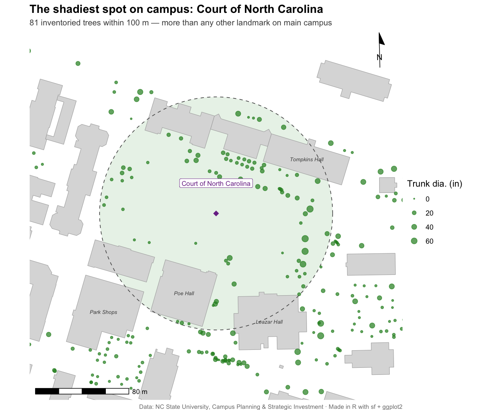
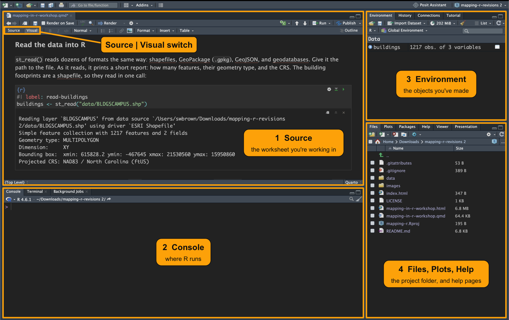

::: callout-important
## How to use this file

This is the worksheet we use in the session. All of the code is written for you. Run each chunk as we talk it through, and try things out in the Console as we go.

- **Run chunks one at a time, from the top down,** with the green ▶ button or *Cmd/Ctrl + Shift + Enter*. Later chunks use objects that earlier ones make.
- **The finished version is online** at <https://ncsu-libraries.github.io/mapping-r/>, with every map already drawn. Use it to catch up if you fall behind.
- **Render** runs every chunk and turns the file into a web page. You can do it at the end, but you don't need to.
:::

## Welcome {.unnumbered}

Most people who come to a mapping session have the same goal: *I have some locations (study sites, sample points, buildings) and I want a decent map of them.* That's what we'll do today, with real campus data: building footprints, NC State's tree inventory, and a short spreadsheet of well-known campus spots. We'll use it to answer one question: **which place on campus has the most trees around it?**

By the end of this hour you will be able to:

1.  **Explain what makes data "spatial"**: geometry, coordinate reference systems (CRS), and the fact that an `sf` object is *just a data frame with a geometry column*.
2.  **Get your data into R**, whether it's a shapefile, a geodatabase, or a spreadsheet of coordinates.
3.  **Ask a question only spatial data can answer**: draw a buffer around each landmark, count what falls inside, and find the shadiest spot on campus.
4.  **Make a publication-quality map** you'd actually put in a poster or paper.

### Where we're headed {.unnumbered}

This is the map we'll finish with:

{fig-alt="The finished map: the winning landmark with its dashed circle, the trees inside it sized by trunk diameter, and the building footprints around it." width="85%"}

To get there, we'll:

1.  **Get oriented** in RStudio and in this worksheet.
2.  **Learn a little GIS**: raster and vector data, and coordinate reference systems. (@sec-gis)
3.  **Read four kinds of files into R**: a shapefile, a geodatabase, an Excel sheet and a CSV. Then clip them to main campus. (@sec-data)
4.  **Look at what makes the data spatial in R**, and put every layer on the same coordinate reference system. (@sec-anatomy)
5.  **Ask the spatial question**: draw a 100 m circle around each landmark and count the trees inside it. (@sec-explore)
6.  **Make the map.** (@sec-map)
7.  **Take home a checklist** for loading your own data. (@sec-checklist)

------------------------------------------------------------------------

## Find your way around RStudio {.unnumbered}

This worksheet is written for RStudio. Here's a quick tour before we start.

### The four panes {.unnumbered}

RStudio splits its window into four panes:

- **Source** (top left): the file you're working in. This worksheet opens here.
- **Console** (bottom left): where R runs. Code you run from the worksheet shows up here, and you can type a single command here to try it.
- **Environment** (top right): the objects you've made, such as `trees` or `buildings`. Click one to look inside.
- **Files, Plots and Help** (bottom right): the project folder, and help pages. Type `?st_buffer` in the Console to see one.

{fig-alt="RStudio with four outlined and numbered panes: 1 Source, the worksheet, at top left; 2 Console, where R runs, at bottom left; 3 Environment, the objects you've made, at top right; 4 Files, Plots and Help at bottom right. A fifth label points to the Source and Visual buttons above the worksheet." width="100%"}

To move the panes around, use **Tools → Global Options → Pane Layout**. On a small screen, give the worksheet the whole window with **View → Panes → Zoom Source** (Ctrl + Shift + 1). Do the same again to go back.

### What a `.qmd` file is {.unnumbered}

This worksheet is a Quarto document, a `.qmd` file. It keeps two things in one place: text, like this paragraph, and **code chunks**, the shaded boxes of R code. You read the explanation, then run the chunk below it, and the results show up right under the chunk.

- **Run a chunk:** click the green ▶ at the chunk's top right, or put your cursor in it and press Cmd/Ctrl + Shift + Enter.
- **Run one line:** put your cursor on it and press Cmd/Ctrl + Enter.
- **Render:** the **Render** button runs every chunk from top to bottom and turns the whole file into a web page. That's how `mapping-in-r-workshop.html` in this folder was made.

Inside a chunk, a line that starts with `#` is a comment, which R skips. We use comments to say what the next line does. Lines that start with `#|` are chunk options: `#| label:` names the chunk, and `#| fig-cap:` gives a map its caption.

For a one-page overview of the format, see the [Quarto cheatsheet](https://rstudio.github.io/cheatsheets/html/quarto.html).

### Set up your view {.unnumbered}

- **Visual or Source.** The **Source | Visual** switch at the top left of the Source pane, marked in the screenshot above, changes how the file looks. *Visual* shows formatted headings, tables and pictures, much like a word processor. *Source* shows the plain text underneath. Either works for running code, but only Visual shows the pictures in this worksheet. Quarto's [Hello, Quarto tutorial](https://quarto.org/docs/get-started/hello/rstudio.html) shows the same file both ways.
- **The outline.** The **Outline** button at the top right of the Source pane (or Cmd/Ctrl + Shift + O) lists every heading in the file. Click one to jump to it.

------------------------------------------------------------------------

## Setup {.unnumbered}

An R **package** is a bundle of functions that someone else has written and shared, so you don't have to write them yourself. You install a package once, then load it with `library()` in each session that uses it. Packages we will use:

- **`sf`**: the modern standard for *vector* spatial data (points, lines, polygons).
- **`dplyr`**: attribute wrangling. `sf` objects work with `filter()`, `mutate()`, `count()` and `group_by()` directly.
- **`ggplot2` + `ggspatial`**: mapping. `geom_sf()` draws geometry; `ggspatial` adds the scale bar and north arrow.
- **`readxl`**: reads `.xls` and `.xlsx` files straight into a data frame, for the attribute table we join on.

, CC BY 4.0.](images/sf-horst.jpg){fig-alt="Cartoon under the title 'sf: spatial data... simplified.' Fuzzy monsters glue and tape colorful map shapes onto the rows of a table labeled 'attributes + geometries.' Text reads 'Sticky geometries: for people who love their maps and sanity.'" width="70%"}

Rather than assume those are already installed, the chunk below checks first and installs whatever's missing. Then `library()` loads each one. Run it now: the first time, installing `sf` can take a few minutes, and it can run while we talk through @sec-gis.

```{r}
#| label: libraries
pkgs <- c("sf", "dplyr", "ggplot2", "ggspatial", "readxl")

# Compare against the installed list to find what's missing, and install only those.
missing <- pkgs[!pkgs %in% rownames(installed.packages())]

if (length(missing) > 0) {
  message("Installing: ", paste(missing, collapse = ", "))
  install.packages(missing, repos = "https://cloud.r-project.org")
}

library(sf)
library(dplyr)
library(ggplot2)
library(ggspatial)
library(readxl)
```

::: callout-tip
## Extra: why the setup is written this way

This is a snippet worth keeping in your back pocket. It's the difference between a script that runs on *your* machine and one that runs on a colleague's.

- **Install only what's missing.** Calling `install.packages()` unconditionally re-downloads and recompiles packages you already have. For `sf` that means several slow minutes, and on a shared machine it may fail outright on permissions.
- **Name the repo explicitly.** `repos = "https://cloud.r-project.org"` means the line also works when R is running non-interactively (in a render, a scheduled job, or CI), where there's no mirror set and no one to answer the "choose a CRAN mirror" prompt.
- **Still call `library()` one per line.** Anyone reading your script should be able to see the dependencies at a glance.

This handles *missing* packages, not *outdated* ones. If a package is installed but too old for the code, you'll get a confusing error rather than an install. `packageVersion("sf")` is how you check.
:::

::: callout-tip
## Extra: a note on the ecosystem

If you go hunting for tutorials, you'll find old code using `sp`, `rgdal`, `rgeos`, or `maptools`. **Those were retired from CRAN at the end of 2023.** Today's world is `sf` for vector data. If a Stack Overflow answer loads `rgdal`, it's stale. Move on.
:::

------------------------------------------------------------------------

## A short introduction to GIS {#sec-gis}

A GIS (geographic information system) is software for data tied to places on Earth: storing it, analyzing it, and mapping it. ArcGIS and QGIS are the best-known desktop ones. R, with the packages we just loaded, does much of the same work in code.

Every spatial dataset answers two questions: *where* (the geometry) and *what* (the attributes, such as a tree's species or a building's name).

### Raster and vector data

A GIS stacks its data in **layers**, one for each theme: land use, elevation, streets, buildings. Each layer holds one of two kinds of data:

- **Raster** data is a grid of cells, like the pixels in a photo. Each cell holds one value: a color, an elevation, a land-cover class. Satellite imagery and elevation models are rasters.
- **Vector** data is a set of features, each with exact coordinates: a tree at one point, a building outlined by its corners.

 (2012), CC BY-NC-SA 3.0.](images/gis-layers.jpg){fig-alt="Five map layers stacked above an illustrated town: land usage and elevation as grids of colored cells, then parcels as outlined shapes, streets as lines, and customers as dots." width="55%"}

Today is all vector data: our layers are buildings, trees, campus boundaries and landmarks. For rasters in R, the package to use is `terra`.

### Points, lines and polygons {#sec-geomtypes}

Vector features come in three basic shapes:

- **Points**: one location each. Our trees and campus landmarks are points.
- **Lines**: a path through a series of points, such as a road, a river or a sidewalk. We won't use any today.
- **Polygons**: a closed shape with an area. Our building footprints and campus boundaries are polygons.

 (2012), CC BY-NC-SA 3.0.](images/points-lines-polygons.jpg){fig-alt="A painted map of streets and parcels with three magnified circles: points as small dots, lines as street edges, and polygons as parcel outlines." width="55%"}

### Coordinate reference systems {#sec-gis-crs}

A pair of numbers like `(-78.67, 35.79)` is only a location once you know what system it's measured in. That system is the **coordinate reference system (CRS)**. There are two kinds:

- A **geographic** CRS gives positions as angles on a model of the globe: longitude and latitude, in degrees. GPS coordinates are geographic, and the usual code for them is **EPSG:4326** (WGS 84). A degree isn't a fixed distance: a degree of longitude is about 111 km at the equator, about 90 km in Raleigh, and nothing at the poles.
- A **projected** CRS flattens part of the globe onto a plane and measures x and y in meters or feet. Distances and areas come out in those units. The campus files use one: NC State Plane, in US feet.

, ArcGIS Pro documentation. © Esri. All rights reserved. Used under Esri's terms for noncommercial teaching.](images/geographic-vs-projected.png){fig-alt="Left: a globe with a point labeled 40 degrees west, 40 degrees north. Right: a flat world map with the same point labeled in meters." width="70%"}

### Projections: wrapping paper around a globe

Going from the globe to a flat map is called **projecting**. Imagine wrapping a sheet of paper around a globe: rolled into a cylinder, shaped into a cone, or laid flat against one point. Where the paper touches the globe, the map is accurate. The farther you go from where it touches, the more the map has to stretch, and shapes, areas, distances or directions go wrong.

No flat map can keep all of those right everywhere. Each projection picks what to protect, and where. Most web maps use Mercator, which keeps the shapes of small areas right but inflates areas toward the poles: Greenland looks about as big as Africa, which is about 14 times larger.

That's why there are projections made for one region. NC State Plane is a cone that cuts the globe along two lines of latitude across North Carolina. UTM, which we'll use in @sec-transform, turns the cylinder on its side so it meets the globe along a narrow north–south band, one zone at a time. Each is accurate in its own area and distorted far from it. So choose a projection made for the place your data is.

More on distortion:

- xkcd's [Map Projections](https://xkcd.com/977/), the funny version.
- [The True Size Of](https://www.thetruesize.com) lets you drag a country toward the equator and watch it shrink.
- Jakub Nowosad's [animation](https://commons.wikimedia.org/wiki/File:Worlds_animate.gif) shrinks every country from its Mercator size to its true size.
- The USGS [Map Projections poster](https://pubs.usgs.gov/publication/70047422) compares the common projections and what each one keeps.

### R as a GIS, compared with a desktop GIS

Desktop GIS software such as ArcGIS Pro and QGIS works by pointing and clicking. R works by writing code. Each is better at different jobs:

|                          | R (code)                                          | Desktop GIS (point and click)                                    |
|--------------------------|---------------------------------------------------|------------------------------------------------------------------|
| **Getting started**      | Takes time to learn the language                  | Tools are in menus, so you can explore right away, though there are a lot of buttons |
| **Repeating a task**     | Rerun the script, on one file or a hundred        | Batch mode and ModelBuilder (ArcGIS Pro) or the Graphical Modeler (QGIS) repeat tools over many files |
| **Showing your work**    | The script is a record anyone can rerun and check | The geoprocessing history lists the tools you ran, but not every edit or styling choice |
| **Custom analysis**      | Change any function, or write your own            | Limited to the tools the software provides                       |
| **Drawing new features** | Small edits only (the `mapedit` package)          | Built for it: tracing, snapping and topology tools               |
| **Georeferencing and 3D** | Possible, but harder                             | Well supported: fitting scanned maps to coordinates, LiDAR       |
| **Map design**           | Precise and repeatable, but every setting is code | Quicker to try layouts by eye                                    |

Which one suits a job depends on the task, how repeatable the work needs to be, and your own skills: drawing new features suits a desktop GIS, and an analysis you'll rerun suits R. The same files open in both. Today is about the R side, where every step is written down, so you can rerun it on your own data.

*Table adapted from "The Geospatial Landscape," [Data Carpentry: Introduction to Geospatial Concepts](https://datacarpentry.github.io/organization-geospatial/04-geo-landscape.html) (CC BY 4.0), and from section 10.1 of [Geocomputation with R](https://r.geocompx.org/gis.html) by Robin Lovelace, Jakub Nowosad and Jannes Muenchow.*

------------------------------------------------------------------------

## Get the workshop data {#sec-data}

Before we write any analysis, everyone needs the same datasets in the same place.

### What you already have

You downloaded this file as part of the workshop zip, so the data came with it. It's in the `data/` folder next to this document. (Need the files again later? Everything lives at <https://github.com/NCSU-Libraries/mapping-r>.)

- `BLDGSCAMPUS.shp`: campus building footprints. A shapefile is actually *several* files (`.shp`, `.dbf`, `.shx`, `.prj`, …) that must stay together in the same folder.
- `NCSU_TreeInventory/NCSU_TreeInventory.gdb`: the campus tree inventory, as an Esri **File Geodatabase**. A `.gdb` is a *folder*, not a single file. Keep it intact and don't rename what's inside.
- `CAMPUSPERIMETER_ALL.shp`: the campus precinct boundaries. We use these to clip everything down to main campus.
- `NCStateBuildingsData.xls`: building names and addresses, to join onto the footprints.
- `NCState_places.csv`: a short list of well-known campus spots as lat/lon coordinates.

::: callout-important
## Please read the data disclaimer

The tree inventory is provided by **NC State University, Campus Planning & Strategic Investment**, and ships with a disclaimer (`Disclaimer.txt`) in the data folder. Two things every participant should understand: the data **may be incomplete or inaccurate**, and it should be used **for this workshop only**, not for official, legal, or commercial purposes.

> **Disclaimer — Campus Planning & Strategic Investment, NC State University**
>
> NC State University makes every effort to produce and publish the most current and accurate content possible. However, the maps and data are produced for informational purposes and are NOT surveys. The information is compiled from various sources and not intended for official use or legal reference. The user of this site should not solely rely on the data provided herein. The information provided may not be used for commercial purposes or sold.
:::

**Open the project first**, if you haven't already. It differs by editor:

- **RStudio:** double-click `mapping-r.Rproj` in the unzipped folder.
- **Positron:** launch Positron first, then **File → Open Folder** and choose the unzipped `mapping-r-main` folder. (Double-clicking the `.Rproj` doesn't reliably launch Positron.)

Either of these points R at the project folder, which is what makes the short file paths below work. To confirm, `list.files()` lists what's in a folder. The first line should list `BLDGSCAMPUS.shp`, `CAMPUSPERIMETER_ALL.shp` (each with its partner files), `NCStateBuildingsData.xls`, `NCState_places.csv` and the `NCSU_TreeInventory` folder. The second should list the `.gdb` inside that folder.

```{r}
#| label: check-files
list.files("data")
list.files("data/NCSU_TreeInventory")
```

::: callout-warning
## Gotcha: an empty list means the wrong folder

Empty, or an error? You're almost certainly in the wrong working directory rather than missing the files. `getwd()` shows where R thinks it is; opening `mapping-r.Rproj` is the fix.
:::

### Read the data into R

`st_read()` reads dozens of formats the same way: shapefiles, GeoPackage (`.gpkg`), GeoJSON, and geodatabases. Give it the path to the file. As it reads, it prints a short report: how many features, their geometry type, and the CRS. The building footprints are a shapefile, so they read in one call:

```{r}
#| label: read-buildings
buildings <- st_read("data/BLDGSCAMPUS.shp")
```

The tree inventory is a File Geodatabase. A `.gdb` can hold *several* layers, so `st_read()` needs two things: the path to the `.gdb` folder, and `layer`, the name of the layer you want. `st_layers()` lists what's inside so you can copy the exact name. This one holds two layers: the current inventory and an older one.

```{r}
#| label: read-trees
st_layers("data/NCSU_TreeInventory/NCSU_TreeInventory.gdb")

trees <- st_read(
  "data/NCSU_TreeInventory/NCSU_TreeInventory.gdb",
  layer = "NCSU_TreeInventory_20251107"
)
```

::: callout-tip
## Extra: reading a `.gdb` directly, no ArcGIS export needed

`sf` reads File Geodatabases natively (via GDAL's OpenFileGDB driver), so there's no need to export to shapefile first. That's a good thing: shapefiles truncate field names to 10 characters and flatten some data types, so your attributes are safer straight from the `.gdb`. If you're ever choosing a format for your *own* data, GeoPackage (`.gpkg`) is the friendly, modern, non-proprietary option: an open standard that ArcGIS, QGIS and R all read.
:::

### Focus on main campus {#sec-clip}

We only want main campus, but the layers we just read cover more than that. Read in the campus boundaries the same way:

```{r}
#| label: read-perimeters
perimeters <- st_read("data/CAMPUSPERIMETER_ALL.shp")
```

Then draw everything we have so far on one map. `plot(st_geometry(x))` is the quickest look at a layer: `st_geometry()` keeps only the shapes, and `plot()` draws them. `add = TRUE` draws on top of the map before it instead of starting a new one. `plot()` sizes the map to fit the first layer it draws, so the buildings go first. This should be a map of campus. Is it?

```{r}
#| label: before-clip
#| fig-cap: "Everything we've read, before clipping."
# lwd = 3 thickens the outlines so a lone footprint still shows up as a dot.
plot(st_geometry(buildings), border = "grey20", lwd = 3, axes = TRUE)
plot(st_geometry(perimeters), add = TRUE, border = "grey55")
plot(st_geometry(trees), add = TRUE, pch = 20, cex = 0.4, col = "forestgreen")
```

::: callout-warning
## Gotcha: the data covers far more than campus

That isn't a map of campus. The buildings layer covers NC State property across the state, plus one footprint in Georgia (bottom left) and one at NC State's campus in Prague (top right), and the map stretches across the Atlantic to fit them all. The axes are in feet, and they run into the tens of millions. North Carolina, with every tree we have, is the cluster in the lower left. The header warned us, too: the buildings' `Bounding box` runs from about 600,000 to 21.5 million feet.

You'll see this often with real data: a layer covers far more than your question does. Map it before you analyze it, and you find out how much more.
:::

::: callout-warning
## Gotcha: `plot()` without `st_geometry()`

`plot(trees)` *without* `st_geometry()` draws **one map per column**, which is surprising and slow. Wrap the layer in `st_geometry()` for a plain map.
:::

To zoom in on main campus, we clip the layers to the campus boundaries. First, work out which column holds the precinct names. `names()` lists the columns, and `st_drop_geometry()` shows the table without the shapes. Look for the column with names like "Central Campus".

```{r}
#| label: perimeter-inspect
names(perimeters)
st_drop_geometry(perimeters)
```

The attribute we need is `Precinct_N`. **North Campus** and **Central Campus** together are what people mean by main campus, so `filter()` keeps those two rows. Then `layer[boundary, ]` does the clipping. In `sf`, the square brackets accept a shape where you'd normally give row numbers: `buildings[main_campus, ]` keeps the rows of `buildings` that touch `main_campus`, whole, and drops the rest. Behind the scenes it runs `st_intersects()`, which we'll meet in @sec-question.

The tree inventory also flags trees that have been taken out. We're about to ask a question about shade, so we drop those too. Clipping takes the buildings from 1,217 footprints to 209, and the trees from 4,424 to the 1,925 still standing on main campus.

```{r}
#| label: clip-main-campus
main_campus <- perimeters |>
  filter(Precinct_N %in% c("North Campus", "Central Campus"))

# sf's square brackets accept a shape instead of row numbers:
# keep the rows that touch main campus
buildings <- buildings[main_campus, ]
trees <- trees[main_campus, ]

# Drop the trees that have been removed
trees <- trees |> filter(spacestatus != "Removed")

# 209 footprints and 1,925 standing trees
nrow(buildings)
nrow(trees)
```

Draw the map again. Now you can see campus: the buildings, and the trees lining the streets and quads between them. Clipping early, in one place, is what keeps the rest of the session fast and the maps legible.

```{r}
#| label: after-clip
#| fig-cap: "After clipping: main campus, its buildings, and its trees."
plot(st_geometry(main_campus), border = "grey55", axes = TRUE)
plot(st_geometry(buildings), add = TRUE, col = "grey80", border = "grey40")
plot(st_geometry(trees), add = TRUE, pch = 20, cex = 0.4, col = "forestgreen")
```

### Join the building attributes {#sec-attr-join}

The buildings layer has very little in it: an internal ID, a building number, and the geometry. The building names and addresses are in an Excel spreadsheet. An **attribute join** brings them together by matching rows on a column both tables share, called the *key*. Here the key is the building number: `BLDGNUM` in the footprints and `BLDG_NUM` in the spreadsheet.

, CC0.](images/left-join.gif){fig-alt="Animation: two small tables slide together, rows with matching keys merge into one row, and the unmatched row from the left table keeps an empty value." width="60%"}

`read_excel()` reads the spreadsheet. `left_join(x, y, by = c("x_column" = "y_column"))` keeps every row of `x` and adds the matching columns from `y`. There's nothing spatial about it; it's plain dplyr. Keep the sf object on the left and the result is still sf, with the geometry untouched. Afterwards, count the footprints that found no match. It should be 0.

```{r}
#| label: join-attributes
# The footprints: "OBJECTID", "BLDGNUM", "geometry"
names(buildings)

bldg_attrs <- read_excel("data/NCStateBuildingsData.xls")

# BLDG_NUM, BLDG_NAME, STATUS_DESCR, SITE_DESCR, ADDRESS, ...
names(bldg_attrs)

buildings <- buildings |>
  left_join(bldg_attrs, by = c("BLDGNUM" = "BLDG_NUM")) |>
  # A short name field for the map labels later
  rename(name = BLDG_NAME)

# How many footprints failed to find a match?
sum(is.na(buildings$name))

buildings |>
  st_drop_geometry() |>
  select(BLDGNUM, name, SITE_DESCR, ADDRESS) |>
  head()
```

::: callout-warning
## Gotcha: joins fail on key *type*, not key value

`left_join()` matches `"004"` to `"004"`, but never `"004"` to `4`. Campus building numbers are text: they have letters (`843B`) and leading zeros (`004`), so both sides must be character. Open this spreadsheet in Excel and re-save it and Excel will helpfully turn `004` into the number `4`, and those rows will silently stop matching. If a join comes back all `NA`, check `class()` on both key columns first.
:::

### The third layer: a spreadsheet of landmarks {#sec-csv}

Our last dataset is the kind most people actually arrive with: a plain spreadsheet, with a column of latitudes and a column of longitudes. `data/NCState_places.csv` is a hand-typed list of well-known campus spots, and it's what we'll ask our spatial question about in @sec-explore. `read.csv()` reads it, and `str()` shows its columns. Nothing about it is spatial to R yet: `lat` and `lon` are ordinary numbers.

```{r}
#| label: csv-source
places_csv <- read.csv("data/NCState_places.csv")

str(places_csv)
```

`st_as_sf()` turns a table into spatial data. Two of its arguments do the real work:

- **`coords`**: which columns hold the coordinates, in **x, y** order. Longitude *first*, then latitude.
- **`crs`**: what those numbers mean. You *tell* R this; it cannot work it out. For plain GPS longitude and latitude, it's `4326`.

When you print the result, read the header: geometry type **POINT**, CRS **WGS 84**. `lat` and `lon` are gone from the columns, because they became the `geometry` column, while `name`, `type` and `photo_url` came along untouched. It's a data frame with a geometry column, exactly like the layers we read off disk.

```{r}
#| label: st-as-sf
places <- st_as_sf(places_csv, coords = c("lon", "lat"), crs = 4326)

places
```

::: callout-warning
## Gotcha: the two ways this goes wrong

**Putting latitude first.** People say "lat/long", and this CSV lists `lat` first, so it's easy to write `coords = c("lat", "lon")`. But `coords` wants x, then y: longitude first, as in the chunk above. Swap them and R faithfully places campus at 35.8°E, 78.7°S, in the middle of Antarctica. Nothing errors. You just get a map of nowhere.

**Forgetting `crs = 4326`.** Without it, R stores the numbers but has no idea where on Earth they are, and every later step (mapping, measuring, joining) silently misbehaves. If your coordinates look like `-78.6, 35.7`, they're almost always lon/lat, i.e. `crs = 4326`.
:::

Check that the points landed where you meant them to. Plot the points first, so they set the map's extent, then draw the campus boundaries into that window. The boundaries are in feet and the points are in degrees, so `st_transform()` converts the boundaries to match. There's more on that in @sec-transform.

```{r}
#| label: csv-check
#| fig-cap: "Sanity check: the places land inside the campus boundaries, across several precincts."
# Drawn first, the boundaries would shrink campus to a dot: they cover
# NC State land statewide, out to the farms and field labs.
plot(st_geometry(places), pch = 19, col = "#7B3294", axes = TRUE)
plot(st_geometry(st_transform(perimeters, 4326)), add = TRUE, border = "grey55")
```

Finally, clip the landmarks to main campus. The two precinct polygons don't quite meet where the railroad cuts through campus, and the Free Expression Tunnel sits in that gap. So we clip to main campus's bounding *box*, the rectangle around it, instead of the polygons themselves, and the tunnel survives. `st_bbox()` finds the rectangle, and `st_as_sfc()` turns it into a shape we can clip with. Nine landmarks are on main campus.

That on-ramp (table → `st_as_sf()` → check → clip) is how you work with any spreadsheet of coordinates, and it's exactly how you'd bring in your own study sites.

```{r}
#| label: clip-places
campus_box <- st_as_sfc(st_bbox(st_transform(main_campus, st_crs(places))))

places <- places[campus_box, ]

places$name
```

------------------------------------------------------------------------

## What makes data "spatial" in R? {#sec-anatomy}

### An `sf` object is a data frame with a geometry column

This is the whole mental model. Print one and you'll see a normal table with a spatial header on top and a geometry column at the end. The column's name comes from the source file: for our tree data it's `Shape`.

In the header, look for the geometry **type**, the **dimension** (`XY`: two coordinates per point), the **bounding box** (the extent), and the **CRS**. Underneath is the familiar data frame. Everything you know about data frames still works, and the geometry comes along for the ride.

```{r}
#| label: print
trees
```

### Geometry types

@sec-geomtypes introduced the three basic shapes. `st_geometry_type()` tells you which one each feature is, and `unique()` boils that down to one answer per layer. It returns a *factor*, and printing a factor also lists every value it could take: all 18 geometry types `sf` knows. `as.character()` prints just the answer:

```{r}
#| label: geom-types
# POINT: one location each
as.character(unique(st_geometry_type(trees)))
# MULTIPOLYGON: an area. "Multi" means one feature can have several pieces.
as.character(unique(st_geometry_type(buildings)))
```

### The coordinate reference system {#sec-crs}

@sec-gis-crs explained what a CRS is. In R, `st_crs()` returns a layer's CRS, and `$Name` pulls out its name. Ask each layer what it's in. The two layers from campus GIS use NC State Plane, in feet. The landmarks are in WGS 84 degrees, because that's what we told `st_as_sf()`. All three are correct. They just can't be compared with each other until they're on a common CRS.

```{r}
#| label: crs
# The tree inventory
st_crs(trees)$Name
# The buildings, from the same campus GIS office
st_crs(buildings)$Name
# Our spreadsheet
st_crs(places)$Name
```

#### What happens if you ignore it?

Less than you'd expect, which is the problem. The quick check is to compare two layers' CRSs directly with `==`:

```{r}
#| label: crs-check
# FALSE: they don't match
st_crs(places) == st_crs(trees)
```

A map won't necessarily tell you. `ggplot()` reprojects every layer to match the first one as it draws, so a ggplot of these two layers looks fine. Base `plot()` draws the numbers as they are. The landmarks are on this map too, about two million units off its left edge. `st_coordinates()` shows why: one layer is in degrees and the other in feet.

```{r}
#| label: crs-plot
#| fig-cap: "The landmarks are on this map too, about two million units off its left edge."
plot(st_geometry(trees), pch = 20, cex = 0.3, col = "forestgreen", axes = TRUE)
# Nothing appears
plot(st_geometry(places), add = TRUE, pch = 19, col = "#7B3294")

# Degrees: about -78.66, 35.79
st_coordinates(places[1, ])
# Feet: about 2,098,056, 741,280
st_coordinates(trees[1, ])
```

No landmarks, and no error. Spatial operations are safer: they run the same check, and refuse. `st_crs(x) == st_crs(y) is not TRUE` is the error to recognize. It means: reproject one layer to match the other.

```{r}
#| label: crs-refuse
#| error: true
st_intersects(places, trees)
```

### Reproject onto a common CRS (in meters) {#sec-transform}

In @sec-explore we'll relate the landmarks to the trees and measure a distance, "within 100 meters". The first needs the layers on one CRS. The second is easiest in a *projected* CRS in meters, where `dist = 100` plainly means 100 meters.

`st_transform(x, crs)` converts a layer to another CRS. Give it the layer and the target, either as an EPSG code or as another layer's `st_crs()`. We'll use **UTM zone 17N (EPSG:32617)**, a metric CRS made for the strip of the globe that includes Raleigh. Afterwards, `units_gdal` should say `"metre"`, and the `==` check from @sec-crs should pass. From here on we use the `_m` layers.

```{r}
#| label: transform
trees_m <- st_transform(trees, 32617)
buildings_m <- st_transform(buildings, 32617)
places_m <- st_transform(places, 32617)

# Now "metre"
st_crs(trees_m)$units_gdal
# TRUE: the CRS check passes now
st_crs(places_m) == st_crs(trees_m)
```

::: callout-tip
## Extra: how do you know which EPSG code to use?

An EPSG code is a short ID for a full CRS definition. `st_crs(32617)` prints the whole definition, including its units and the part of the world it's meant for. To find a code:

- **Search by place.** [epsg.io](https://epsg.io) and [spatialreference.org](https://spatialreference.org) take a place name ("North Carolina") and list the systems made for it, with their units and area of use.
- **Ask R.** The `crsuggest` package looks at where your data is and suggests projected CRSs that fit it: `crsuggest::suggest_crs(places)`. It's a separate install.

For a map of one city or region, two families are almost always a good choice:

- **UTM** splits the world into 60 north–south zones, each 6° of longitude wide, measured in meters. The zone number is `floor((longitude + 180) / 6) + 1`, so Raleigh, at −78.7°, is in zone 17. The code is 326 plus the zone number north of the equator (32617) and 327 plus the zone number south of it.
- **State Plane** is a US system with one or more zones per state, each tuned to be accurate there. North Carolina's is EPSG:32119 in meters, or EPSG:2264 in US feet, which is what the campus files already use.

Either would work here. For a whole country or continent, where areas need to stay true, use an equal-area projection instead (EPSG:5070 for the lower 48 US states).
:::

::: callout-tip
## Extra: `sf` and longitude/latitude

Given lon/lat data, `sf` measures on a sphere, so `st_distance()` reports meters and `st_buffer()` takes `dist` in meters, even on EPSG:4326 data. See the `dist` argument in [`?st_buffer`](https://r-spatial.github.io/sf/reference/geos_unary.html), and the vignette [Spherical geometry in sf](https://r-spatial.github.io/sf/articles/sf7.html). Not every tool does this. PostGIS's [`ST_Buffer()`](https://postgis.net/docs/ST_Buffer.html), for example, takes the distance in the layer's own units, which for lon/lat data are degrees. Measuring in a projected CRS, where you know the units, works the same everywhere.
:::

::: callout-warning
## Gotcha: a layer with no CRS

If `st_crs()` ever comes back `NA` for a layer, its CRS wasn't recorded, and `st_transform()` will refuse to run. Find out what it should be, set it with `st_set_crs()`, and then transform.
:::

------------------------------------------------------------------------

## Explore, then ask one spatial question {#sec-explore}

### Attribute exploration is just the tidyverse

Because an `sf` object is a data frame, ordinary `dplyr` works. Use `st_drop_geometry()` when you only care about the attributes. It's faster, and it stops the geometry from tagging along through every summary. `count(common, sort = TRUE)` counts the trees of each species, most common first.

```{r}
#| label: eda
trees_m |>
  st_drop_geometry() |>
  count(common, sort = TRUE)
```

### The spatial question: which place is the shadiest? {#sec-question}

Here is something a plain table simply cannot answer: *how many trees are within a hundred meters of the Belltower?* Nothing in the tree inventory mentions the Belltower. Nothing in the landmark spreadsheet mentions trees. The only thing relating the two is **where they are**, which is the whole reason to bother with spatial data.

It takes two steps.

**Step 1: a buffer.** `st_buffer(x, dist)` grows every feature of `x` outward by `dist`. A point becomes a circle with a radius of `dist`. `dist` is in the layer's CRS units, which are meters because we projected to UTM.

 (2012), CC BY-NC-SA 3.0.](images/buffers.jpg){fig-alt="Three panels: red points, red lines and red polygons, each surrounded by a pale buffer zone." width="80%"}

**Step 2: count what's inside.** `st_intersects(x, y)` asks, for each feature of `x`, which features of `y` it touches or overlaps. It hands back a list with one element per circle, holding the row numbers of the trees inside it. `lengths()` turns that list into a count. Order matters: circles first, trees second, so we get one count per circle.

, ch. 11, © 2012–2023 Paul Ramsey, Mark Leslie and PostGIS contributors, CC BY-SA 3.0.](images/intersects.png){fig-alt="Eight panels of geometry pairs that intersect: a point on a multipoint, points on lines, lines touching lines and polygons, and points inside polygons." width="45%"}

Why 100 m? It's roughly a one-minute walk, about the range over which shade actually influences where you'd choose to sit. The radius is a decision, not a fact, so pick yours deliberately and be ready to justify it. Reporting "the shadiest spot on campus" without naming the radius is the spatial-analysis equivalent of a bar chart with no y-axis.

The result: the **Court of North Carolina** takes it with 81 trees, and the **Brickyard** comes last with 14. Both should feel obviously right to anyone who has walked across campus. The Court is the old tree-lined quad, and the Brickyard is about an acre of brick.

```{r}
#| label: buffer-count
# Step 1: turn each landmark into a circle. dist is in meters.
radius <- 100
shade <- st_buffer(places_m, dist = radius)

# Step 2: count the trees inside each circle
shade$n_trees <- lengths(st_intersects(shade, trees_m))

shade |>
  st_drop_geometry() |>
  select(name, type, n_trees) |>
  arrange(desc(n_trees))
```

Now make the question itself visible: each landmark with its 100 m circle. Look at where the circles overlap. The tint doubles up, and so does the count: a tree between two landmarks is counted for both. That's correct here, because each question ("how many trees near the Court?") is asked independently of the others. If you ever need to assign every tree to exactly *one* landmark, that's a different tool: `st_nearest_feature()`.

```{r}
#| label: buffer-viz
#| fig-width: 9
#| fig-height: 6
#| fig-cap: "Each landmark with its 100 m circle. The buffers *are* the question."
# The map window: every landmark, plus 250 m around it
focus <- st_bbox(st_buffer(places_m, 250))

ggplot() +
  geom_sf(data = buildings_m, fill = "grey93", color = "grey84", linewidth = 0.15) +
  geom_sf(data = trees_m, color = "forestgreen", size = 0.35, alpha = 0.5) +
  # The circles, then the landmarks at their centers
  geom_sf(data = shade, fill = "#7B3294", alpha = 0.10,
          color = "#7B3294", linetype = "dashed", linewidth = 0.5) +
  geom_sf(data = places_m, color = "#7B3294", size = 2) +
  coord_sf(xlim = focus[c("xmin", "xmax")], ylim = focus[c("ymin", "ymax")]) +
  theme_minimal()
```

::: callout-tip
## Extra: change the radius

Change the buffer and you can change the answer. Set `radius` to 50 or 150 and re-run the buffer chunk. At **50 m** the Memorial Belltower wins with 20 trees. At **100 m** the Court of North Carolina takes it with 81. At **150 m** the Court holds the lead but everything behind it reshuffles. None of those is wrong. They answer subtly different questions: *right at the monument* versus *in the surrounding block*.
:::

::: callout-warning
## Gotcha: same code, wrong units, no error

Suppose we had skipped UTM and put the landmarks on the trees' CRS instead. That's a reasonable choice: it's the CRS the campus files came in. The code runs just the same:

```{r}
#| label: feet-trap
places_ft <- st_transform(places, st_crs(trees))
# "US survey foot"
st_crs(places_ft)$units_gdal

# 100 ... feet, this time
shade_ft <- st_buffer(places_ft, dist = radius)
data.frame(name = places_ft$name,
           n_trees = lengths(st_intersects(shade_ft, trees)))
```

The Court of North Carolina drops from 81 trees to 0, because these are 100-*foot* circles. Nothing errors, and the CRSs match. The one check that catches it is `units_gdal`: always know what `dist` is measured in.
:::

::: callout-tip
## Extra: the vocabulary of spatial relationships

`st_buffer()` and `st_intersects()` are two of a family. The others you'll reach for:

- `st_join(points, polygons, join = st_within)`: *which region contains each point?* This is a **spatial join**, the classic point-in-polygon. It works like the attribute join in @sec-attr-join, except the rows are matched by where they are instead of by a key column.
- `st_intersects()`, `st_contains()`, `st_touches()`: true/false spatial tests.
- `st_nearest_feature()`: *which feature is each point closest to?*
- `st_distance()`: actual distances between features.

 (2012), CC BY-NC-SA 3.0.](images/spatial-join.jpg){fig-alt="Two points labeled 1 and 2, plus a circle split into halves A and B, give the same two points labeled 1A and 2B." width="70%"}

Same idea every time: **relate features by where they are.** That's what makes the data spatial.
:::

------------------------------------------------------------------------

## Making the map {#sec-map}

We have an answer. Now we need a map that *shows* it: one map, centered on the winner, carrying three things: the landmark, the buildings around it, and the trees. First we get three pieces ready. Then we draw the plain shapes, and then the finished map.

### Get the pieces ready

#### The winner

`slice_max(n_trees, n = 1)` keeps the row with the most trees: the winning circle, with its count. `filter()` then finds the same landmark in `places_m`, as a point. The map needs both: the circle to draw, and the point to mark and label.

```{r}
#| label: winner
winner <- shade |> slice_max(n_trees, n = 1)
winner_pt <- places_m |> filter(name == winner$name)

winner$name
```

#### The map window

`st_bbox()` returns a layer's bounding box: its `xmin`, `ymin`, `xmax` and `ymax`. Buffering the circle by another 60 m first leaves some room around it. Later, `coord_sf(xlim = , ylim = )` zooms the map to this box. The layers still hold all of main campus; the window only chooses what we look at.

**On your own map:** take `st_bbox()` of your study area, or of the features you care about, and buffer it first for a margin, in your CRS's units.

```{r}
#| label: map-window
view <- st_bbox(st_buffer(winner, 60))

view
```

#### Which buildings to label

Labeling every building would bury the map in text, so we label four: the largest buildings that touch the circle. Because they touch it, they're always inside the window, and no label gets cut off at the edge.

- `buildings_m[winner, ]` keeps the buildings that touch the circle. It's the same square-bracket clip as in @sec-clip: a shape inside the brackets instead of row numbers.
- `st_area()` measures each footprint, in square meters. `as.numeric()` drops the units so `slice_max()` can sort by it.
- `slice_max(area_m2, n = 4)` keeps the four largest.
- `st_centroid()` turns each footprint into a single point at its center, which is where its label will go.

**On your own map:** keep the features inside your window, rank them by whatever matters (size, visitors, a category), and label only the top few.

```{r}
#| label: edge-labels
edge <- buildings_m[winner, ]
edge$area_m2 <- as.numeric(st_area(edge))
edge_labels <- edge |> slice_max(area_m2, n = 4) |> st_centroid()

edge_labels$name
```

::: callout-warning
## Gotcha: a centroid can land outside its shape

The centroid of an L- or U-shaped building can fall in its courtyard, outside the footprint. If a label lands somewhere odd, swap `st_centroid()` for `st_point_on_surface()`, which always returns a point inside the shape.
:::

### Step 1: the shapes

`geom_sf()` draws any `sf` layer, and works out on its own whether it's points, lines or polygons. Each `geom_sf()` adds one layer to the map. `coord_sf()` does the zooming, to the window we just made.

```{r}
#| label: map1
#| fig-cap: "Just the shapes, cropped to the winning landmark. Every map starts here."
ggplot() +
  geom_sf(data = buildings_m) +
  geom_sf(data = trees_m) +
  coord_sf(xlim = view[c("xmin", "xmax")], ylim = view[c("ymin", "ymax")])
```

::: callout-warning
## Gotcha: overlapping axis labels

On a narrow map, the longitude labels along the bottom can run into each other. Ask for fewer of them with `+ scale_x_continuous(n.breaks = 3)`, or tilt them with `+ theme(axis.text.x = element_text(angle = 45, hjust = 1))`. The finished map below doesn't have the problem, because `theme_void()` removes the axes.
:::

### Step 2: the finished map

The finished map adds everything else at once. The code is long, but it comes in groups, and a comment above each group says what it does:

- **Layers, bottom to top.** Each `geom_sf()` paints over the ones before it, so the order you write them in is the order you see them. A pale green tint of the circle goes first, *under* the buildings, so it colors the ground without washing out the footprints. Then the buildings in grey, so they recede, and the circle again as a dashed outline: the rule the answer rests on, drawn where a reader can check it.
- **The trees and the landmark.** `aes(size = dbh)` sizes each tree by its trunk diameter, a fair stand-in for canopy, and so for shade. Inside `aes()`, a setting becomes a mapping: it varies with the data. Outside `aes()`, as in `color = "forestgreen"`, it's the same for every feature. The landmark goes on top as a purple diamond.
- **Labels.** `geom_sf_text()` writes the building names at the points in `edge_labels`. `geom_sf_label()` writes the landmark's name in a white box, nudged up (`nudge_y`, in meters) so it doesn't cover the marker.
- **The size scale.** `scale_size_continuous()` sets the smallest and largest dot sizes, and the legend's title.
- **The window.** `coord_sf()` zooms to `view`. `expand = FALSE` stops `ggplot2` from adding a margin around it.
- **Scale bar and north arrow.** Both come from `ggspatial`. `location` takes two letters: `"bl"` is bottom left, `"tr"` top right.
- **Title, subtitle and caption.** The title and subtitle are built from `winner` and `radius` with `paste0()`, not typed. Change `radius` in @sec-question and the map retitles itself, even if the winner changes. The caption credits the data.
- **Theme.** `theme_void()` removes the axes and grid lines, which a map doesn't need. `theme()` then styles the text.

**On your own map:** swap in your own layers and keep the order: context at the bottom, then the evidence, then your data, with labels on top.

```{r}
#| label: map-final
#| fig-width: 8.4
#| fig-height: 7
#| fig-cap: "The deliverable: one place, one number, and the evidence for both."
ggplot() +
  # Layers, bottom to top: a tint under the circle, the buildings, then the
  # circle again as a dashed outline
  geom_sf(data = winner, fill = "#eaf3ea", color = NA) +
  geom_sf(data = buildings_m, fill = "grey86", color = "grey68", linewidth = 0.25) +
  geom_sf(data = winner, fill = NA, color = "grey35", linetype = "dashed",
          linewidth = 0.4) +
  # The trees, sized by trunk diameter, and the landmark on top
  geom_sf(data = trees_m, aes(size = dbh), color = "forestgreen", alpha = 0.7) +
  geom_sf(data = winner_pt, color = "#7B3294", size = 3, shape = 18) +
  # Labels: the buildings around the edge, and the landmark in a box
  geom_sf_text(data = edge_labels, aes(label = name), size = 2.3, color = "grey30",
               fontface = "italic", check_overlap = TRUE) +
  geom_sf_label(data = winner_pt, aes(label = name), size = 2.9, nudge_y = 26,
                fill = "white", color = "#7B3294", linewidth = 0.2) +
  # The range of tree dot sizes, and the legend title
  scale_size_continuous(range = c(0.4, 3.4), name = "Trunk dia. (in)") +
  # Zoom to the window, with no extra margin
  coord_sf(xlim = view[c("xmin", "xmax")], ylim = view[c("ymin", "ymax")],
           expand = FALSE) +
  # Scale bar at bottom left, north arrow at top right
  annotation_scale(location = "bl", width_hint = 0.28) +
  annotation_north_arrow(location = "tr", which_north = "true",
                         style = north_arrow_minimal()) +
  # Title and subtitle are built from the results, so they update themselves
  labs(
    title = paste0("The shadiest spot on campus: ", winner$name),
    subtitle = paste0(winner$n_trees, " inventoried trees within ", radius, " m — ",
                      "more than any other landmark on main campus"),
    caption = "Data: NC State University, Campus Planning & Strategic Investment · Made in R with sf + ggplot2"
  ) +
  # No axes or grid lines, then style the text
  theme_void() +
  theme(
    plot.title = element_text(face = "bold", size = 14),
    plot.subtitle = element_text(color = "grey30", size = 10),
    plot.caption = element_text(color = "grey50", size = 7.5),
    legend.position = "right"
  )
```

```{r}
#| label: final-map-image
#| include: false
# Only when the file is rendered: save this map for "Where we're headed" at the top.
if (isTRUE(getOption("knitr.in.progress"))) {
  ggsave("images/final-map.png", width = 8.4, height = 7, dpi = 150, bg = "white")
}
```

To save the map at print resolution, `ggsave()` writes the last map you drew to a file. `width` and `height` are in inches, and `dpi = 300` is print quality.

```{r}
#| label: save
#| eval: false
ggsave("shadiest_spot.png", width = 8.4, height = 7, dpi = 300)
```

::: callout-tip
## Extra: four cartography habits worth naming

- **Let context recede.** Buildings are grey so the trees read first. The eye should land on what the map is *about*.
- **Draw the evidence.** The dashed circle isn't decoration. It's the rule behind the claim, put where a reader can check it.
- **Account for what's missing.** `dbh` is blank for 17 of these trees, and `aes(size = dbh)` drops them silently (with a warning you'll scroll past). For anything you publish, decide on purpose: give them a fixed small size, or note the exclusion in the caption.
- **Choose colorblind-safe colors.** Red against green is the pair colorblind readers most often can't tell apart, so the landmark here is purple, not red: the purple end of a purple–green scheme from [ColorBrewer](https://colorbrewer2.org), which marks the schemes that stay distinct for colorblind readers. The landmark also differs from the trees in shape, size and label, so color isn't doing the work alone. When you color by species, reach for `viridis` or `Dark2`.
:::

------------------------------------------------------------------------

## Checking a new data file {#sec-checklist}

When you load a layer of your own, a few quick checks catch most problems before they turn into confusing errors later:

1.  **Did you get what you expected?** `st_read()` prints the number of features and fields, and the geometry type. For a `.gdb` or `.gpkg`, run `st_layers()` first to pick the right layer.
2.  **Does it have a CRS, and does it match your other layers?** `st_crs(x)$Name` names it. `NA` means the file didn't record one: find out what it should be and set it with `st_set_crs()`. Compare two layers with `st_crs(a) == st_crs(b)`, not by reading the names. Two files can print the same name and still differ in the fine print, and `sf` compares the whole definition.
3.  **Does it cover what you think?** Map it before you analyze it: `plot(st_geometry(x))`. Check the `Bounding box` in the header, too. Our buildings reached from Georgia to Prague.
4.  **Is it 2D or 3D?** Read the `Dimension:` line in the header. `XY` is plain. `XYZ` also has a **Z**, usually elevation; `XYM` has a "measure", such as a milepost; `XYZM` has both. A list such as `XY, XYZ` means the features don't agree, and that mix can break `st_transform()` and the maps after it, with an error such as `OGR: Corrupt data` that doesn't point back to the cause. `st_zm(x)` drops the Z and M, and `st_z_range(x)` returns `NULL` once there's no Z left. The original campus files for this workshop had exactly this mix, so we removed the Z values for today.
5.  **Are the shapes valid?** Polygons from other software sometimes cross over themselves. `st_is_valid(x)` returns `TRUE` or `FALSE` for each feature, and `st_make_valid(x)` repairs them. Errors that mention `Loop 0 is not valid` or `TopologyException` mean invalid shapes.
6.  **Are any shapes empty?** `st_is_empty(x)` finds features with no geometry at all.
7.  **Will your join keys match?** Run `class()` on both key columns. IDs with letters or leading zeros must be character on both sides. After joining, count the `NA`s.

Here are the checks in one place, run on the buildings:

```{r}
#| label: checklist
# What's in the file, before you read it
st_layers("data/BLDGSCAMPUS.shp")

# The CRS, and whether it matches another layer's
st_crs(buildings)$Name
st_crs(buildings) == st_crs(trees)

# NULL: no Z values
st_z_range(buildings)

# How many invalid shapes, and how many empty ones?
sum(!st_is_valid(buildings))
sum(st_is_empty(buildings))

# The join key: character, so "004" keeps its zeros
class(buildings$BLDGNUM)
```

------------------------------------------------------------------------

## Wrap-up

In one session we went from "what is spatial data?" to a finished map:

- GIS data is **raster** (a grid of cells) or **vector** (points, lines and polygons), and today was all vector
- an `sf` object is a **data frame with a geometry column**
- the **CRS** tells R what the coordinates mean. Compare layers with `st_crs(a) == st_crs(b)`, and put them on a common *projected* CRS before you measure anything
- data comes in via **`st_read()`** (shapefiles, geodatabases), **`st_as_sf()`** (coordinate spreadsheets), and an ordinary **`left_join()`** for attribute tables
- **look before you analyze**: a quick `plot()` shows what a layer covers
- **clipping to a study area** early, in one place, is what keeps a campus map legible
- **`st_buffer()` + `st_intersects()`** answered a question no attribute table could: which place has the most trees around it
- **`geom_sf()` + `ggspatial`** turn layers into a publishable map
- the **checklist** in @sec-checklist is the place to start with your own data

------------------------------------------------------------------------

## Before You Go

### Evaluate our Workshop

We appreciate your input. Let us know how this Workshop went for you! We take your input seriously and appreciate the time you take to give it. Please fill out [our workshop evaluation](https://go.ncsu.edu/dss-workshop-eval).

### Need Additional Help?

We are available to help you with whatever question you have about this Workshop or programming in general. If you run into snags or questions (we all do), as you start to create programs for yourself, reach out to [Get Data Help](https://go.ncsu.edu/getdatahelp). Send an email, make an appointment, or reserve a workstation! We are here to assist you to be successful in your data science journey.

------------------------------------------------------------------------

## Where to go next

### Resources

- **Geocomputation with R**: free online, the standard reference: <https://r.geocompx.org/>
- **`sf` documentation & vignettes**: <https://r-spatial.github.io/sf/>
- **r-spatial.org**: news and deeper dives from the maintainers

### Take it further (good exercises)

- Map **your own** CSV of sites: `read.csv()` → `st_as_sf()` → `geom_sf()`.
- Change `radius` in @sec-question and see whether the winner survives it.
- Rank by *canopy* instead of by count: swap `lengths(st_intersects(...))` for a `st_join()` and `sum(dbh, na.rm = TRUE)` per landmark. Does the Brickyard's handful of big trees change its standing?
- Flip the question with `st_nearest_feature()`: assign every tree to its closest landmark, then `count()`.
- Color the trees by species (`aes(color = common)`). You'll need to lump the long tail into "Other" first, or the legend will run off the page.

### Bonus: putting your points on a basemap

We didn't cover this in the hour, but it's the most common follow-up question: *how do I get my points on top of satellite imagery, or a street map?*

**The current go-to is [`maptiles`](https://cran.r-project.org/package=maptiles)**, paired with `tidyterra` for the drawing. There's no single package in R, but `maptiles` is actively maintained, covers a long list of providers, and does the one thing that used to be painful: it hands back a raster **already reprojected into your layer's CRS**, so you don't have to think about Web Mercator at all.

```{r}
#| label: basemap-satellite
#| eval: false
install.packages(c("maptiles", "tidyterra"))
library(maptiles)
library(tidyterra)

# get_tiles() wants an area, so hand it the map window from the map section.
view_area <- st_as_sfc(st_bbox(st_buffer(winner, 60)))

sat <- get_tiles(view_area, provider = "Esri.WorldImagery", zoom = 18, crop = TRUE)

ggplot() +
  # The tiles go FIRST, underneath everything else
  geom_spatraster_rgb(data = sat, maxcell = Inf) +
  geom_sf(data = winner, fill = NA, color = "white",
          linetype = "dashed", linewidth = 0.6) +
  geom_sf(data = trees_m, aes(size = dbh), color = "yellow", alpha = 0.85) +
  geom_sf(data = winner_pt, color = "#D6A6FF", size = 3.5, shape = 18) +
  scale_size_continuous(range = c(0.4, 3.2), name = "Trunk dia. (in)") +
  coord_sf(xlim = view[c("xmin", "xmax")], ylim = view[c("ymin", "ymax")],
           expand = FALSE) +
  # Attribution is not optional
  labs(caption = get_credit("Esri.WorldImagery")) +
  theme_void() +
  theme(plot.background = element_rect(fill = "white", color = NA))
```

Worth doing once just to see it: the inventory points land on top of the actual tree canopy in the imagery, which is a far more convincing argument that your data is right than any table.

Four things that trip people up:

- **The tile layer goes first.** `geom_sf()` layers paint in the order you add them, so a basemap added last covers your data.
- **Attribution is a license condition, not a nicety.** `get_credit("<provider>")` returns the exact string the provider requires. Put it in `labs(caption = ...)`.
- **`zoom` is a trade-off.** Higher is sharper and slower, and pulls more tiles from someone else's server. For a campus-block view, 17–18 is about right; for a whole city, 12–13.
- **Set the plot background explicitly.** `theme_void()` leaves it transparent, and a transparent PNG shows up black in some viewers, which will eat your title and your attribution line.

::: callout-warning
## Most of the good-looking providers now want an API key

This has changed recently enough that a lot of tutorials are wrong about it.

- **Keyless, works today:** `"Esri.WorldImagery"` (satellite), `"OpenStreetMap"` (streets; it even labels the Court of North Carolina and the halls around it), and the other `Esri.*` styles. Note that `"Esri.WorldGrayCanvas"` returns *"Map data not yet available"* at campus zoom levels, so it's no use for a close-in map.
- **Key required:** all the `CartoDB.*` styles (including Positron and DarkMatter), every `Stadia.*` style (which is where the old Stamen designs ended up), and `Thunderforest.*`. You still get tiles back, but they're stamped **API KEY REQUIRED** right across your map. If you have a key, pass it with `get_tiles(..., apikey = "…")`.

`names(maptiles::get_providers())` lists everything available.
:::

#### A black-background map needs no basemap at all

Since every dark tile provider now wants a key, the easier route to a dark map is to just style one: no account, no network, no attribution to track.

```{r}
#| label: basemap-dark
#| eval: false
ggplot() +
  geom_sf(data = buildings_m, fill = "grey20", color = "grey35", linewidth = 0.25) +
  geom_sf(data = winner, fill = "white", alpha = 0.05, color = "grey75",
          linetype = "dashed", linewidth = 0.5) +
  geom_sf(data = trees_m, aes(size = dbh), color = "springgreen3", alpha = 0.9) +
  geom_sf(data = winner_pt, color = "#D6A6FF", size = 3.5, shape = 18) +
  scale_size_continuous(range = c(0.4, 3.2), name = "Trunk dia. (in)") +
  coord_sf(xlim = view[c("xmin", "xmax")], ylim = view[c("ymin", "ymax")],
           expand = FALSE) +
  annotation_scale(location = "bl", width_hint = 0.28,
                   text_col = "grey80", line_col = "grey80") +
  labs(title = winner$name,
       subtitle = paste0(winner$n_trees, " trees within ", radius, " m")) +
  theme_void() +
  theme(
    plot.background = element_rect(fill = "grey8", color = NA),
    plot.title = element_text(color = "white", face = "bold", size = 14),
    plot.subtitle = element_text(color = "grey70", size = 10),
    legend.text = element_text(color = "grey80"),
    legend.title = element_text(color = "grey80")
  )
```

The trick is that on a dark ground **every** piece of text needs its color set explicitly: title, subtitle, legend, and the scale bar's `text_col`/`line_col`. Miss one and it stays near-black and vanishes.

#### Other routes worth knowing

- **`ggspatial::annotation_map_tile()`**: you already have `ggspatial` loaded, and this pulls OSM tiles through `rosm` in a single layer. Fewer providers than `maptiles`, but nothing extra to install.
- **`mapview` / `leaflet`**: for a zoomable map in your browser rather than a static figure. The right tool for exploring your own data; the wrong one for a figure in a paper.

------------------------------------------------------------------------
